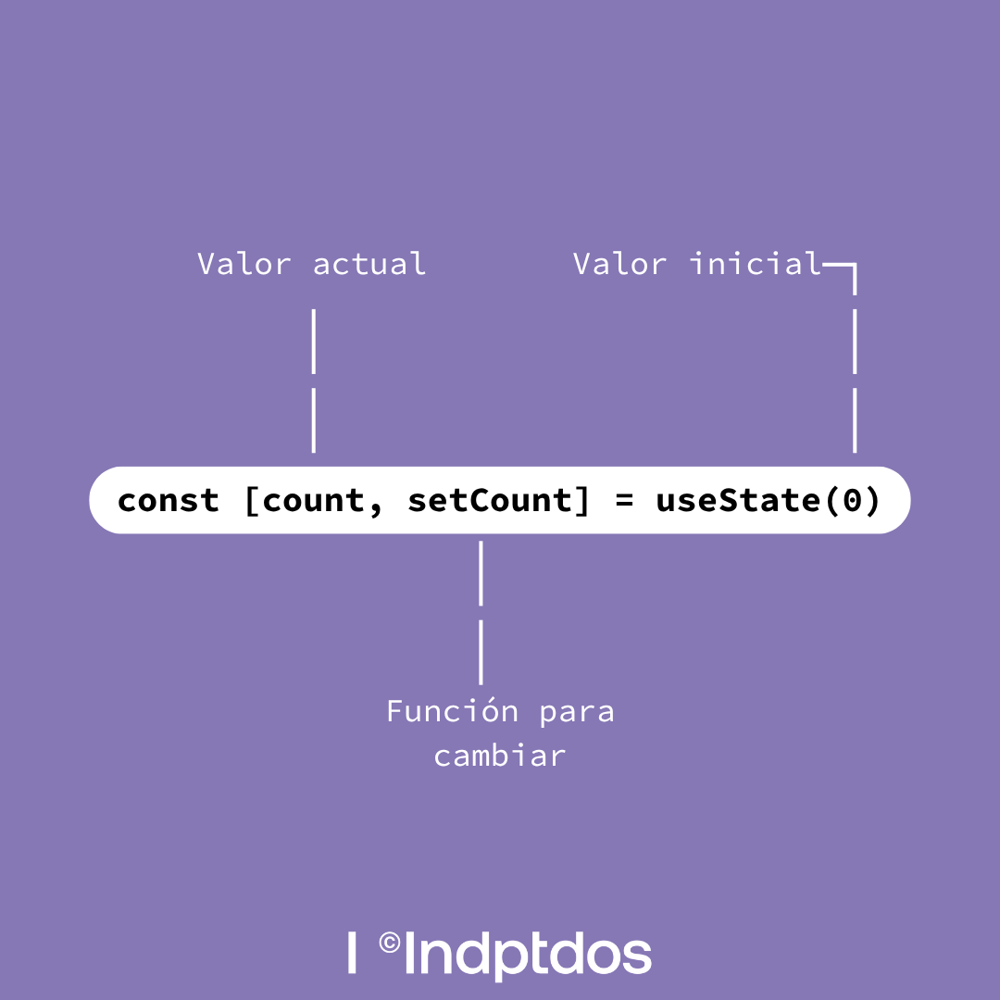
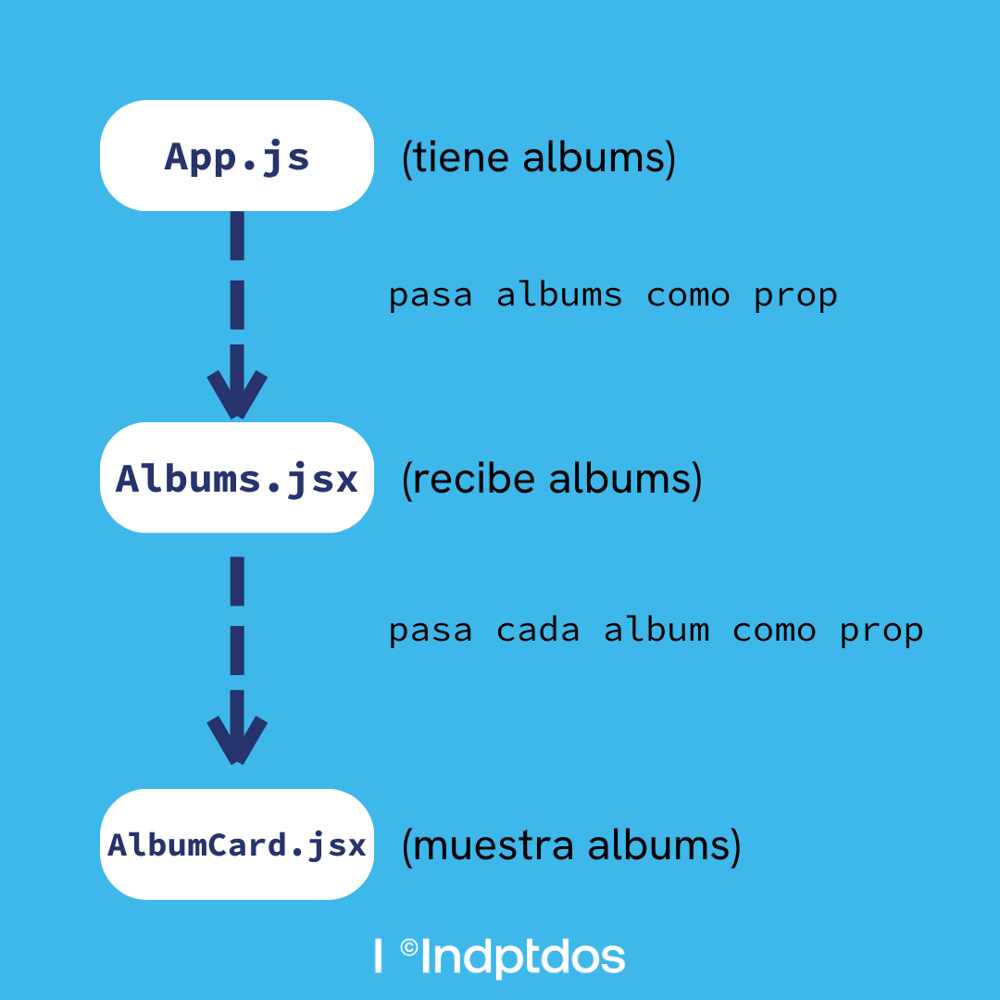
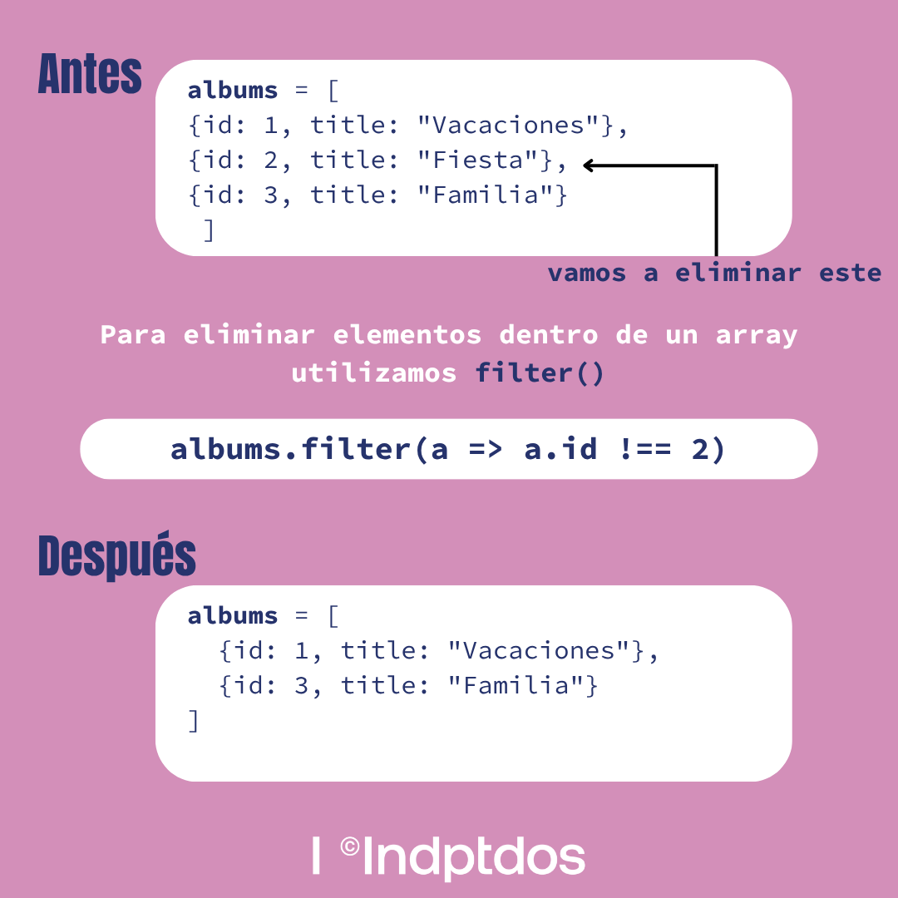
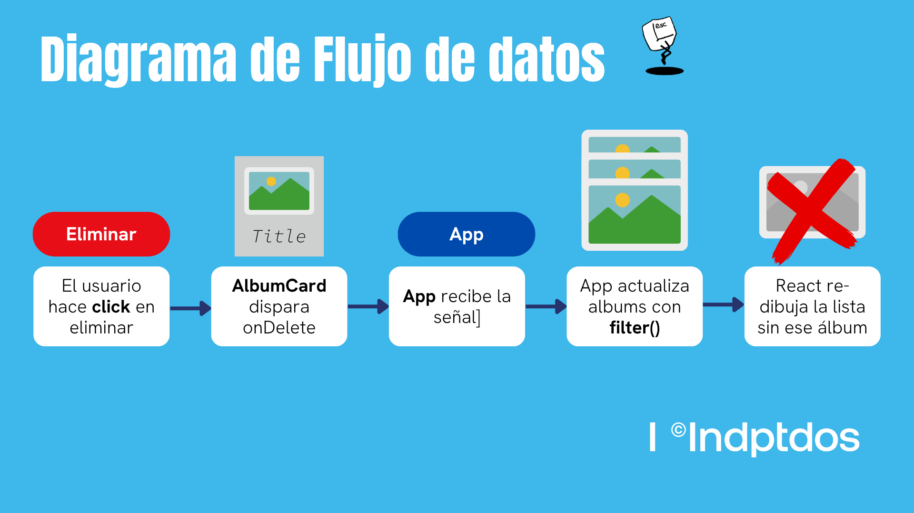

# 🎓 Conceptos React - Explicación Simple

> **💡 Tip**: Si necesitas código rápido, ve a [CHEATSHEET.md](CHEATSHEET.md)
>
> **📚 Navegación**: Usa [INDICE.md](INDICE.md) para encontrar lo que buscas

---

## 📦 1. useState - Tu caja de guardar cosas

### ¿Qué es?
Es como tener una caja donde guardas información que puede cambiar.



*Diagrama: Las tres partes de useState*

### Ejemplo con galletas 🍪
```javascript
// Tienes 5 galletas
const [galletas, setGalletas] = useState(5);

// Te comes una galleta
setGalletas(4); // Ahora tienes 4

// Te comes otra
setGalletas(galletas - 1); // Ahora tienes 3
```

### En la Gallery App
```javascript
// Guardamos el título del álbum
const [titulo, setTitulo] = useState("");

// Cuando escribes en el input
setTitulo("Mis Vacaciones");
```

**📂 Ver en**: `App.js` línea 35, `AlbumForm.jsx` línea 25

---

## 📨 2. Props - Pasar mensajes entre componentes

### ¿Qué es?
Es como darle instrucciones a alguien. Le dices qué hacer.



*Diagrama: Cómo viajan las props de arriba hacia abajo*

### Ejemplo con perro 🐕
```javascript
// Le dices al perro qué hacer
<Perro nombre="Max" color="café" ladrido="Guau!" />

// El perro recibe las instrucciones
function Perro({ nombre, color, ladrido }) {
  return <p>{nombre} es {color} y hace {ladrido}</p>
}
```

### En la Gallery App
```javascript
// Le pasas info al botón
<Button texto="Guardar" color="azul" onClick={guardar} />

// El botón usa esa info
function Button({ texto, color, onClick }) {
  return <button style={{color}} onClick={onClick}>{texto}</button>
}
```

**📂 Ver en**: `Button.jsx` línea 20, `AlbumCard.jsx` línea 15

---

## 🗂️ 3. Arrays - Listas de cosas

### map() - Transformar cada cosa
```javascript
// Tienes números
const numeros = [1, 2, 3];

// Los duplicas
const duplicados = numeros.map(n => n * 2);
// Resultado: [2, 4, 6]
```

**En la app**: Mostrar cada álbum
```javascript
albums.map(album => <AlbumCard album={album} />)
```

### filter() - Quedarte con algunos
```javascript
// Tienes números
const numeros = [1, 2, 3, 4, 5];

// Te quedas con los mayores a 3
const grandes = numeros.filter(n => n > 3);
// Resultado: [4, 5]
```



*Diagrama: Antes y después de usar filter()*

**En la app**: Eliminar un álbum
```javascript
albums.filter(album => album.id !== idEliminar)
```

### Spread (...) - Copiar y agregar
```javascript
// Tienes frutas
const frutas = ["🍎", "🍌"];

// Agregas más
const masFrutas = [...frutas, "🍇", "🍓"];
// Resultado: ["🍎", "🍌", "🍇", "🍓"]
```

**En la app**: Agregar álbum nuevo
```javascript
setAlbums([...albums, nuevoAlbum])
```

**📂 Ver en**: `App.js` líneas 120-150, `Albums.jsx` línea 40

---

## ⚡ 4. useEffect - Hacer cosas especiales

### ¿Qué es?
Es para hacer cosas que NO son dibujar en la pantalla.

### Ejemplos:
- Escuchar cuando presionas teclas
- Guardar en localStorage
- Hacer peticiones a internet
- Bloquear el scroll

### En la Gallery App - Navegación con teclado
```javascript
useEffect(() => {
  // Función que detecta teclas
  const manejarTecla = (e) => {
    if (e.key === 'ArrowRight') siguienteFoto();
    if (e.key === 'Escape') cerrar();
  };

  // Empezar a escuchar
  document.addEventListener('keydown', manejarTecla);

  // Limpieza: dejar de escuchar
  return () => {
    document.removeEventListener('keydown', manejarTecla);
  };
}, []);
```

**📂 Ver en**: `AlbumCarousel.jsx` líneas 50-80, `PhotoViewer.jsx` líneas 45-70

---

## 💾 5. localStorage - Guardar en el navegador

### ¿Qué es?
Es como un baúl en tu navegador donde guardas cosas para después.

### Cómo funciona
```javascript
// GUARDAR
// Convertir a texto y guardar
localStorage.setItem('nombre', 'Pedro');
localStorage.setItem('edad', '25');

// Para objetos, usar JSON
const album = { id: 1, titulo: "Vacaciones" };
localStorage.setItem('album', JSON.stringify(album));


// RECUPERAR
const nombre = localStorage.getItem('nombre'); // "Pedro"

// Para objetos, convertir de vuelta
const album = JSON.parse(localStorage.getItem('album'));
```

### En la Gallery App
```javascript
// Guardar álbumes
const guardarAlbums = (albums) => {
  localStorage.setItem('gallery-albums', JSON.stringify(albums));
};

// Recuperar álbumes
const recuperarAlbums = () => {
  const guardados = localStorage.getItem('gallery-albums');
  return guardados ? JSON.parse(guardados) : [];
};
```

**📂 Ver en**: `utils/localStorage.js`, `App.js` línea 35

---

## 🎨 6. Renderizado Condicional - Mostrar u ocultar

### ¿Qué es?
Decidir QUÉ mostrar según la situación.

### Operador ternario (? :)
```javascript
// SI hay albums, mostrar lista, SI NO, mostrar mensaje
{albums.length > 0
  ? <ListaAlbums albums={albums} />
  : <p>No hay álbumes</p>
}
```

### Operador && (mostrar solo si es verdad)
```javascript
// Solo mostrar si está abierto
{isOpen && <Modal />}

// Es lo mismo que:
{isOpen ? <Modal /> : null}
```

### Early Return (salir rápido)
```javascript
function Albums({ albums }) {
  // Si no hay albums, terminar aquí
  if (!albums || albums.length === 0) {
    return <p>No hay álbumes</p>;
  }

  // Si hay albums, mostrar lista
  return <div>{/* lista de albums */}</div>;
}
```

**📂 Ver en**: `Albums.jsx` línea 30, `ConfirmDialog.jsx` línea 50

---

## 🔄 7. Flujo de Datos - Cómo viaja la información



*Diagrama: Flujo completo desde el usuario hasta React*

### De arriba hacia abajo (Props)
```
        App (tiene albums)
          │
          │ albums={albums}
          ↓
      Albums (recibe albums)
          │
          │ album={album}
          ↓
     AlbumCard (muestra album)
```

### De abajo hacia arriba (Callbacks)
```
   AlbumCard (usuario hace click)
          │
          │ onClick={onDelete}
          ↑
      Albums (recibe señal)
          │
          │ onDelete={handleDelete}
          ↑
        App (elimina el album)
```

**📂 Ver en**: Todo `App.js`

---

## 📝 8. Formularios Controlados

### ¿Qué es?
React controla lo que escribes en el input.

### Sin control (mal ❌)
```javascript
// React NO sabe qué hay en el input
<input type="text" />
```

### Con control (bien ✅)
```javascript
// React SÍ sabe qué hay en el input
const [nombre, setNombre] = useState("");

<input
  value={nombre}
  onChange={(e) => setNombre(e.target.value)}
/>
```

### ¿Por qué?
Porque así puedes:
- Validar mientras escribe
- Limpiar el input
- Guardar en el estado
- Saber siempre qué valor tiene

**📂 Ver en**: `AlbumForm.jsx` líneas 80-120, `PhotoForm.jsx` líneas 90-130

---

## 🎯 9. Event Handlers - Manejar clicks y eventos

### onClick - Cuando haces click
```javascript
const manejarClick = () => {
  alert("¡Hiciste click!");
};

<button onClick={manejarClick}>Click aquí</button>
```

### onChange - Cuando cambias algo
```javascript
const manejarCambio = (e) => {
  console.log("Escribiste:", e.target.value);
};

<input onChange={manejarCambio} />
```

### Con parámetros
```javascript
// Opción 1: Arrow function
<button onClick={() => eliminar(album.id)}>Eliminar</button>

// Opción 2: Bind
<button onClick={eliminar.bind(null, album.id)}>Eliminar</button>
```

**📂 Ver en**: `Button.jsx` línea 25, `AlbumCard.jsx` líneas 60-80

---

## 🔑 10. Key en Listas - Identificar elementos

### ¿Qué es?
Un identificador único para cada elemento de una lista.

### Sin key (mal ❌)
```javascript
albums.map(album =>
  <AlbumCard album={album} />
)
```

### Con key (bien ✅)
```javascript
albums.map(album =>
  <AlbumCard key={album.id} album={album} />
)
```

### ¿Por qué?
React necesita saber qué elemento cambió para ser eficiente.

**Regla**: Usa el `id` único, NUNCA uses el índice del array.

**📂 Ver en**: `Albums.jsx` línea 45, `Photos.jsx` línea 50

---

## 🧩 11. Composición - Combinar componentes

### ¿Qué es?
Poner componentes dentro de otros, como LEGO.

### Ejemplo
```javascript
// Componente que acepta hijos
function Layout({ children }) {
  return (
    <div className="layout">
      <Header />
      <main>{children}</main>
      <Footer />
    </div>
  );
}

// Uso
<Layout>
  <Albums />  ← Este es el "children"
</Layout>
```

### En la Gallery App
```javascript
<Layout>
  <Albums albums={albums} />  ← Cambia según la vista
</Layout>
```

**📂 Ver en**: `Layout.jsx` línea 30, `Button.jsx` línea 20

---

## 🛡️ 12. Inmutabilidad - No cambiar directamente

### ¿Qué es?
NO modificar las cosas directamente. Crear copias nuevas.

### Mal ❌
```javascript
albums.push(nuevoAlbum);        // Modifica directamente
albums[0].title = "Nuevo";      // Modifica directamente
albums.sort();                  // Modifica directamente
```

### Bien ✅
```javascript
// Agregar
setAlbums([...albums, nuevoAlbum]);

// Modificar
setAlbums(albums.map(a =>
  a.id === 1 ? {...a, title: "Nuevo"} : a
));

// Ordenar
setAlbums([...albums].sort());
```

### ¿Por qué?
React compara referencias. Si modificas directamente, React no se da cuenta del cambio.

**📂 Ver en**: Todos los archivos que usan `setAlbums` o `setPhotos`

---

## 🎬 Resumen en 1 minuto

1. **useState** = Caja para guardar cosas
2. **Props** = Pasar información
3. **Arrays** = map, filter, spread
4. **useEffect** = Hacer cosas especiales
5. **localStorage** = Guardar en navegador
6. **Condicional** = Mostrar u ocultar
7. **Flujo** = Arriba → abajo (props), Abajo → arriba (callbacks)
8. **Forms** = React controla inputs
9. **Events** = onClick, onChange
10. **Key** = ID único en listas
11. **Composición** = LEGO de componentes
12. **Inmutabilidad** = No cambiar, crear nuevo

---

## 🗺️ Dónde ver cada concepto

| Concepto | Fácil | Medio | Difícil |
|----------|-------|-------|---------|
| **useState** | `Button.jsx` | `AlbumForm.jsx` | `App.js` |
| **Props** | `Button.jsx` | `AlbumCard.jsx` | `Albums.jsx` |
| **Arrays** | `StatusBar.jsx` | `Albums.jsx` | `App.js` |
| **useEffect** | - | `AlbumCarousel.jsx` | `PhotoViewer.jsx` |
| **localStorage** | - | - | `App.js`, `localStorage.js` |
| **Forms** | - | `AlbumForm.jsx` | `PhotoForm.jsx` |
| **Events** | `Button.jsx` | `AlbumCard.jsx` | `ConfirmDialog.jsx` |

---

## 💡 Tips

1. **No memorices** - Entiende la lógica
2. **Experimenta** - Cambia valores y ve qué pasa
3. **Lee despacio** - Los comentarios explican todo
4. **Empieza simple** - Button.jsx primero
5. **Avanza gradual** - Un archivo a la vez

---

**¿Confundido?** Vuelve a leer este archivo. Todo está explicado con ejemplos simples.
