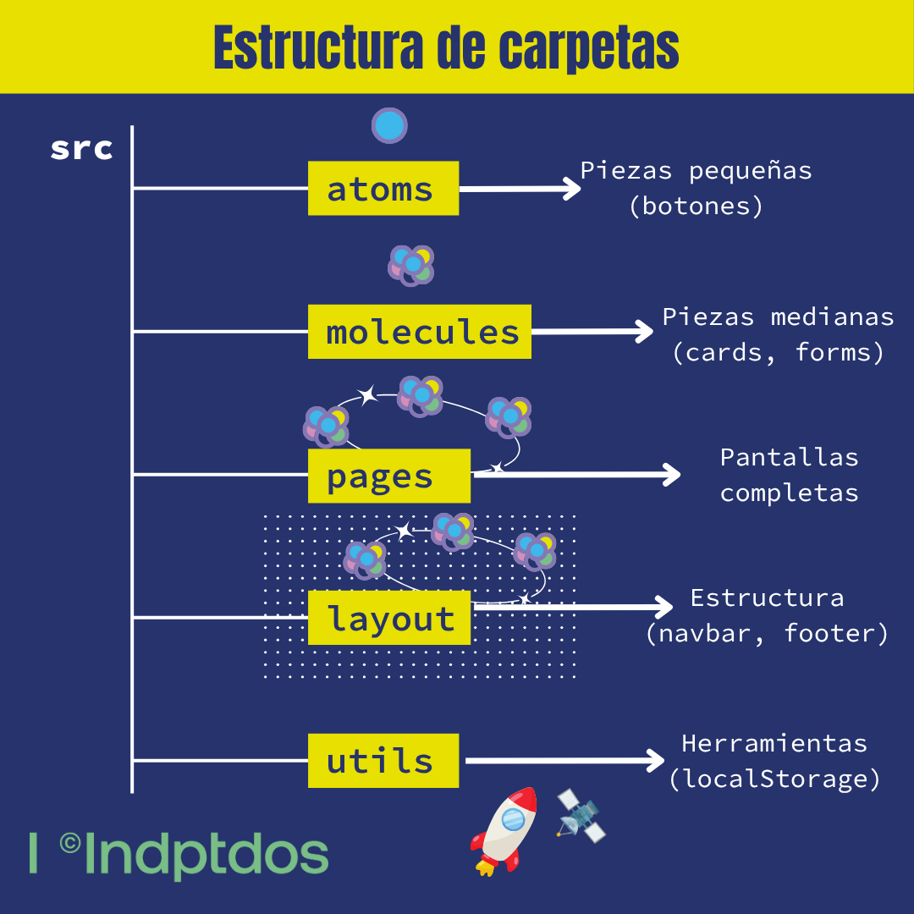

# 📸 Gallery App - Guía Simple

## ¿Qué es esto?

Una app para guardar fotos en álbumes. Como Instagram pero más simple.

Perfecto para aprender React desde cero.

---

## 🎮 ¿Qué puedes hacer?

1. **Crear álbumes** (ejemplo: "Vacaciones 2024")
2. **Agregar fotos** a los álbumes
3. **Ver las fotos** en pantalla completa
4. **Eliminar** álbumes o fotos

**Todo se guarda en tu navegador** - No necesitas internet después de abrirla.

---

## 📚 Documentación Disponible

- **[INDICE.md](INDICE.md)** - Navegación completa y cómo usar la documentación
- **[CONCEPTOS.md](CONCEPTOS.md)** - 12 conceptos React explicados con ejemplos simples
- **[CHEATSHEET.md](CHEATSHEET.md)** - Código listo para copiar y pegar

---

## 🎯 ¿Qué vas a aprender?

### Nivel 1 - Básico (Empieza aquí) ⭐

**📦 useState - Guardar información**
```javascript
// Como una caja donde guardas cosas
const [nombre, setNombre] = useState("Pedro");
```
**Ver en**: `App.js`, `AlbumForm.jsx`

**📨 Props - Pasar información**
```javascript
// Como darle instrucciones a un componente
<Button texto="Guardar" color="azul" />
```
**Ver en**: `Button.jsx`, `AlbumCard.jsx`

**🗂️ Arrays - Listas de cosas**
```javascript
// Agregar álbum nuevo
setAlbums([...albums, nuevoAlbum]);

// Eliminar álbum
setAlbums(albums.filter(a => a.id !== idBorrar));
```
**Ver en**: `App.js` líneas 120-150

---

### Nivel 2 - Intermedio 🚀

**⚡ useEffect - Hacer cosas especiales**
```javascript
// Escuchar cuando presionas teclas
useEffect(() => {
  document.addEventListener('keydown', manejarTecla);
  return () => document.removeEventListener('keydown', manejarTecla);
}, []);
```
**Ver en**: `AlbumCarousel.jsx` líneas 50-80

**📝 Forms - Formularios**
```javascript
// Controlar lo que escribes
<input
  value={titulo}
  onChange={(e) => setTitulo(e.target.value)}
/>
```
**Ver en**: `AlbumForm.jsx`, `PhotoForm.jsx`

**💾 localStorage - Guardar en el navegador**
```javascript
// Guardar
localStorage.setItem('albums', JSON.stringify(albums));

// Recuperar
const albums = JSON.parse(localStorage.getItem('albums'));
```
**Ver en**: `utils/localStorage.js`

---

### Nivel 3 - Avanzado 🎓

**🔄 Flujo de datos - Cómo viaja la información**

```
Usuario hace click → Component llama función → App actualiza state → React re-dibuja
```

**Ver diagrama**: [Flujo de datos completo](#diagrama-flujo)

**🎨 Patrones - Formas de organizar código**

- **Modal**: Ventanas emergentes → `ConfirmDialog.jsx`
- **Composition**: Componentes dentro de componentes → `Layout.jsx`
- **Early Return**: Salir rápido si algo falta → `Albums.jsx`

---

## 📂 Archivos importantes (por dónde empezar)

### 🟢 Fácil - Empieza aquí

1. **`atoms/Button.jsx`** (~120 líneas)
   - 📖 Concepto: Props básicos
   - ⏱️ Tiempo: 15 minutos
   - 🎯 Aprenderás: Cómo pasar información a componentes

2. **`layout/StatusBar.jsx`** (~215 líneas)
   - 📖 Concepto: Mostrar información
   - ⏱️ Tiempo: 20 minutos
   - 🎯 Aprenderás: Usar props para mostrar datos

### 🟡 Medio - Continúa aquí

3. **`molecules/AlbumCard.jsx`** (~435 líneas)
   - 📖 Concepto: Composición de componentes
   - ⏱️ Tiempo: 30 minutos
   - 🎯 Aprenderás: Cómo combinar componentes pequeños

4. **`pages/Albums.jsx`** (~320 líneas)
   - 📖 Concepto: Listas y renderizado
   - ⏱️ Tiempo: 40 minutos
   - 🎯 Aprenderás: Mostrar listas de datos

5. **`molecules/AlbumForm.jsx`** (~515 líneas)
   - 📖 Concepto: Formularios controlados
   - ⏱️ Tiempo: 45 minutos
   - 🎯 Aprenderás: Manejar inputs y formularios

### 🔴 Difícil - Termina aquí

6. **`App.js`** (~500 líneas)
   - 📖 Concepto: State management
   - ⏱️ Tiempo: 60 minutos
   - 🎯 Aprenderás: Manejar estado de toda la app

7. **`pages/AlbumCarousel.jsx`** (~475 líneas)
   - 📖 Concepto: useEffect y eventos
   - ⏱️ Tiempo: 50 minutos
   - 🎯 Aprenderás: Side effects y navegación con teclado

---

## 🎨 Diagramas Visuales

### 1. Flujo de Datos <a id="diagrama-flujo"></a>


**Qué muestra**: Cómo viaja la información desde el usuario hasta React y de vuelta.

---

### 2. Estructura del Proyecto



**Qué muestra**: Organización de carpetas usando Atomic Design (atoms → molecules → pages).

---

### 3. Props en Acción


**Qué muestra**: Cómo los datos se pasan de componente padre a hijo.

---

### 4. Anatomía de useState


**Qué muestra**: Las tres partes de `useState`: valor actual, función para cambiar, valor inicial.

---

### 5. Filter en Arrays


**Qué muestra**: Cómo `filter()` elimina elementos de un array sin modificar el original.

---

## 🤔 Preguntas Frecuentes

**P: ¿Por qué tanto texto en los archivos?**
R: Para que no tengas que buscar en Google. Todo está explicado aquí.

**P: ¿Tengo que leer TODO el código?**
R: No. Sigue la "Ruta de Aprendizaje" arriba. Ve paso a paso.

**P: ¿Qué hago si no entiendo algo?**
R: 1) Lee el código despacio, 2) Busca ejemplos, 3) Pregunta al profesor.

**P: ¿Puedo cambiar el código?**
R: ¡SÍ! Es para experimentar. Rompe cosas y arreglalas.

**P: ¿Cuánto tiempo me tomará?**
R: 15-20 horas para entender todo. Pero en 5 horas ya sabrás lo básico.

---

## 🚀 Empezar AHORA

```bash
# 1. Instalar
npm install

# 2. Ejecutar
npm start

# 3. Abrir navegador
http://localhost:3000

# 4. Jugar con la app

# 5. Abrir src/atoms/Button.jsx y leer los comentarios
```

---

## 📞 Ayuda

¿Atascado? Lee estos archivos EN ORDEN:

1. `atoms/Button.jsx` - El más simple
2. `molecules/AlbumCard.jsx` - Un poco más complejo
3. `App.js` - El cerebro de todo

Cada archivo tiene comentarios explicando CADA línea.

---

**✨ Tip**: No intentes entenderlo todo de una vez. Lee un archivo, juega con él, rómpelo, arréglalo. Así se aprende.
